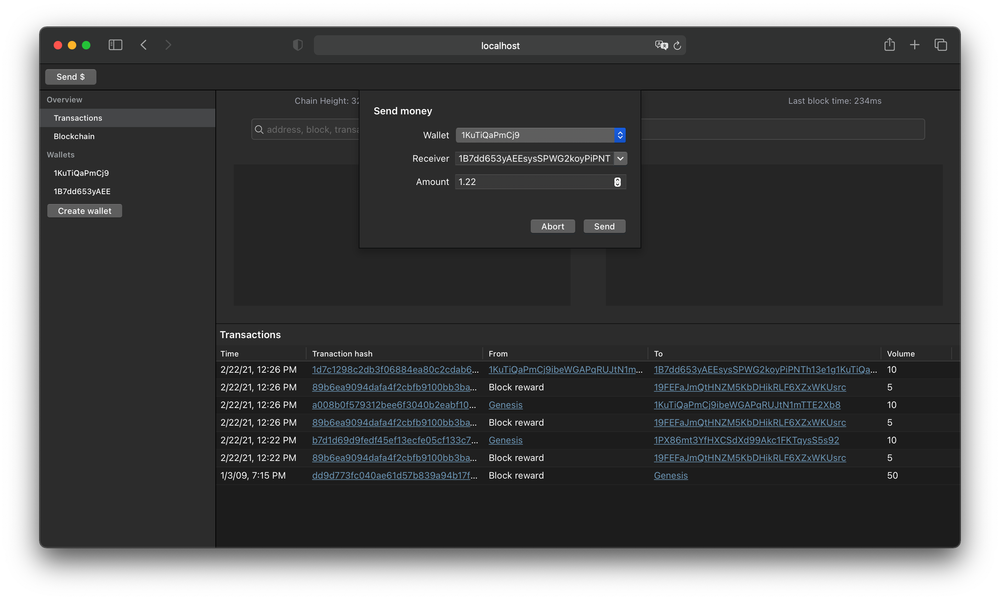
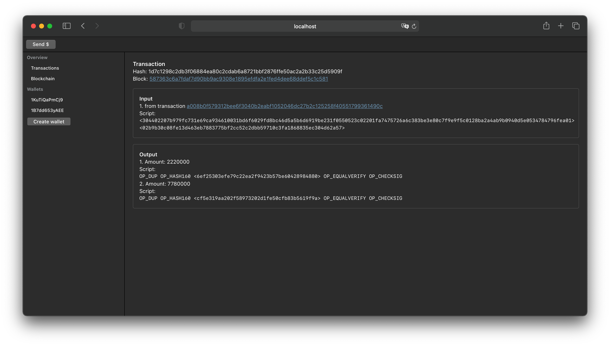
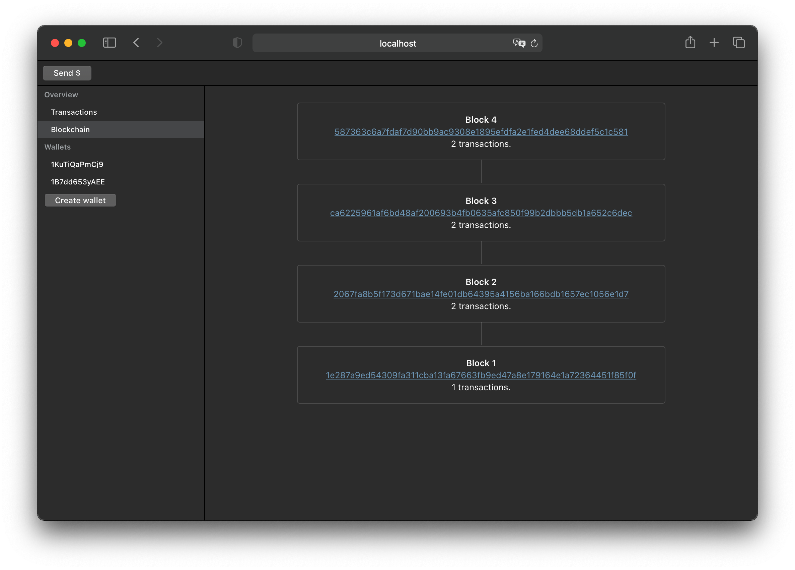

# MyCoin

This is a Typescript implementation of a Cryptocurrency inspired by the Bitcoin blockchain. It uses the same blockchain
binary format and algorithm including the transaction scripting language (although a light version of it). Since its
binary compatible its possible to create transactions for bitcoin miners and read bitcoin blocks and transactions, as
well as to validate transaction input locks + output unlock scripts (aka scriptPubKey/scriptSig).

It's a project to understand the Bitcoin blockchain algorithm in-depth, its binary structure, transaction semantics,
scaling limitations, and performance bottlenecks. The miner RPC protocol of this project is different to Bitcoins RPC
protocol.

This is a mono-repo containing multiple NPM packages.

Currently, supported transaction script OPs are:

- OP_CHECKSIG
- OP_ADD, OP_DUP
- OP_HASH160, OP_SHA256
- OP_EQUAL, OP_VERIFY, OP_EQUALVERIFY
- OP_CODESEPARATOR
- OP_CHECKSIGVERIFY

Thus allowing Pay-To-Pub-Hash and Pay-To-PubKey transactions.

### Packages

The [blockchain package](./packages/blockchain) contains all fundamental models (Wallet, Blockchain, Block, Transaction,
Output, Input), signature/verify logic, validators, the scripting language VM/interpreter, and other algorithms (balance
calculation, transaction generator, etc).

The [miner package](./packages/miner) is a server responsible for maintaining the main blockchain (the one with the
greatest complexity/height), accepting transactions, mining blocks, and distributing transactions, the blockchain, and
mined blocks to peers. The RPC protocol is not based on the Bitcoin miner RPC protocol, instead it is uses @deepkit/rpc,
a binary high-performance RPC auto-inferring protocol for Typescript. The miner also serves the GUI.

The [gui package](./packages/gui) is an Angular frontend connecting to a miner server that allows to create a wallet (
saving private/public key in LocalStorage), issue new transactions, list blocks and transactions.

The [cli package](./packages/cli) contains CLI tools, like e.g. creating a wallet.

### How to use it?

```
git clone git@github.com:marcj/myCoin.git;
cd myCoin;
npm install;
npm run bootstrap;
npm run build;
node packages/cli --help;
```

Start a miner: `NODE_PRESERVE_SYMLINKS=1 node packages/miner server:listen`


### Screenshots






